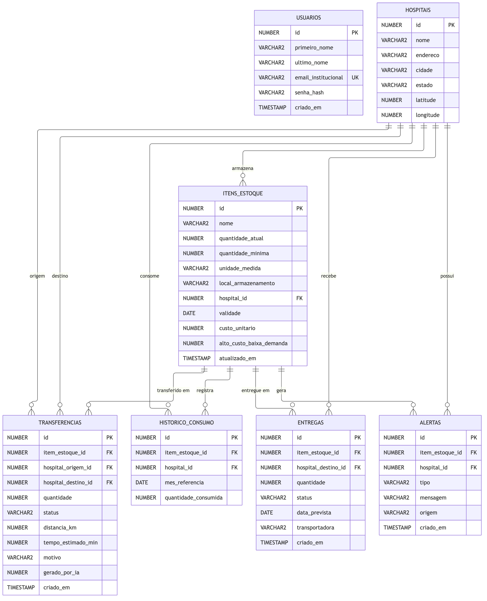
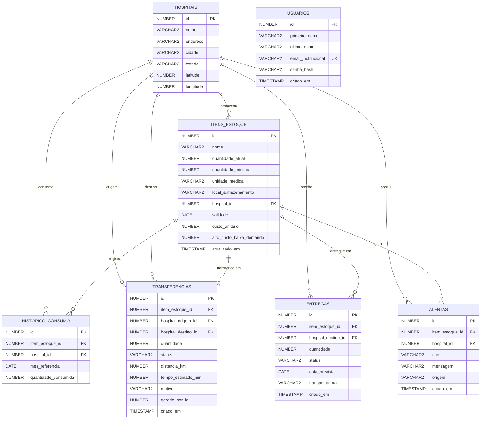

# Modelo de dados - MediStock (Smart HAS)

Modelo relacional implantado no Oracle pelo script [`docs/plsql/medistock_plsql.sql`](../plsql/medistock_plsql.sql). As tabelas espelham as entidades JPA do back-end (`model/`), mais a tabela `ALERTAS`, que é exclusiva da camada PL/SQL.

## Diagrama entidade-relacionamento

## Tabelas

### HOSPITAIS
Rede de hospitais. As coordenadas são usadas no cálculo de distância e rota da logística e da IA de redistribuição.

| Coluna | Tipo | Restrição |
|---|---|---|
| id | NUMBER | PK, identity |
| nome | VARCHAR2(150) | NOT NULL |
| endereco | VARCHAR2(200) | |
| cidade | VARCHAR2(80) | |
| estado | VARCHAR2(2) | |
| latitude | NUMBER | NOT NULL |
| longitude | NUMBER | NOT NULL |

### USUARIOS
Profissionais com acesso ao sistema (login por e-mail institucional + JWT).

| Coluna | Tipo | Restrição |
|---|---|---|
| id | NUMBER | PK, identity |
| primeiro_nome | VARCHAR2(80) | NOT NULL |
| ultimo_nome | VARCHAR2(80) | NOT NULL |
| email_institucional | VARCHAR2(150) | NOT NULL, UNIQUE |
| senha_hash | VARCHAR2(255) | NOT NULL (BCrypt) |
| criado_em | TIMESTAMP | NOT NULL |

### ITENS_ESTOQUE
Insumos de cada hospital. O nível (CRITICO / ATENCAO / NORMAL) é calculado a partir de `quantidade_atual` e `quantidade_minima`.

| Coluna | Tipo | Restrição |
|---|---|---|
| id | NUMBER | PK, identity |
| nome | VARCHAR2(150) | NOT NULL |
| quantidade_atual | NUMBER(10) | NOT NULL |
| quantidade_minima | NUMBER(10) | NOT NULL |
| unidade_medida | VARCHAR2(20) | |
| local_armazenamento | VARCHAR2(150) | |
| hospital_id | NUMBER | NOT NULL, FK → HOSPITAIS |
| validade | DATE | |
| custo_unitario | NUMBER(12,2) | |
| alto_custo_baixa_demanda | NUMBER(1) | NOT NULL, 0/1 |
| atualizado_em | TIMESTAMP | default SYSTIMESTAMP |

### HISTORICO_CONSUMO
Consumo mensal por item e hospital. Base da previsão de demanda da IA e da function `fn_dias_cobertura_estoque`.

| Coluna | Tipo | Restrição |
|---|---|---|
| id | NUMBER | PK, identity |
| item_estoque_id | NUMBER | NOT NULL, FK → ITENS_ESTOQUE (cascade) |
| hospital_id | NUMBER | NOT NULL, FK → HOSPITAIS |
| mes_referencia | DATE | NOT NULL (1º dia do mês) |
| quantidade_consumida | NUMBER(10) | NOT NULL |

### TRANSFERENCIAS
Remanejamento de insumos entre hospitais, manual ou sugerido pela IA.

| Coluna | Tipo | Restrição |
|---|---|---|
| id | NUMBER | PK, identity |
| item_estoque_id | NUMBER | NOT NULL, FK → ITENS_ESTOQUE (cascade) |
| hospital_origem_id | NUMBER | NOT NULL, FK → HOSPITAIS |
| hospital_destino_id | NUMBER | NOT NULL, FK → HOSPITAIS |
| quantidade | NUMBER(10) | NOT NULL |
| status | VARCHAR2(20) | NOT NULL, PENDENTE / EM_ROTA / CONCLUIDA / CANCELADA |
| distancia_km | NUMBER | |
| tempo_estimado_min | NUMBER | |
| motivo | VARCHAR2(300) | |
| gerado_por_ia | NUMBER(1) | NOT NULL, 0/1 |
| criado_em | TIMESTAMP | default SYSTIMESTAMP |

### ENTREGAS
Entregas de fornecedores para os hospitais.

| Coluna | Tipo | Restrição |
|---|---|---|
| id | NUMBER | PK, identity |
| item_estoque_id | NUMBER | NOT NULL, FK → ITENS_ESTOQUE (cascade) |
| hospital_destino_id | NUMBER | NOT NULL, FK → HOSPITAIS |
| quantidade | NUMBER(10) | NOT NULL |
| status | VARCHAR2(20) | NOT NULL, PENDENTE / EM_ROTA / CONCLUIDA / CANCELADA |
| data_prevista | DATE | |
| transportadora | VARCHAR2(150) | |
| criado_em | TIMESTAMP | default SYSTIMESTAMP |

### ALERTAS
Histórico de alertas persistido pela procedure `prc_registrar_alertas_criticos`.

| Coluna | Tipo | Restrição |
|---|---|---|
| id | NUMBER | PK, identity |
| item_estoque_id | NUMBER | FK → ITENS_ESTOQUE (cascade) |
| hospital_id | NUMBER | FK → HOSPITAIS |
| tipo | VARCHAR2(20) | NOT NULL, CRITICO / ATENCAO / INFO |
| mensagem | VARCHAR2(400) | NOT NULL |
| origem | VARCHAR2(150) | local de armazenamento do item |
| criado_em | TIMESTAMP | NOT NULL, default SYSTIMESTAMP |

## Índices

| Índice | Tabela | Colunas | Uso |
|---|---|---|---|
| ix_itens_hospital | ITENS_ESTOQUE | hospital_id | Listagem de estoque por hospital |
| ix_hist_item_mes | HISTORICO_CONSUMO | item_estoque_id, mes_referencia | `fn_dias_cobertura_estoque` |
| ix_hist_hosp_mes | HISTORICO_CONSUMO | hospital_id, mes_referencia | `prc_relatorio_consumo_hospital` |
| ix_alertas_item | ALERTAS | item_estoque_id, criado_em | Deduplicação diária de alertas |
