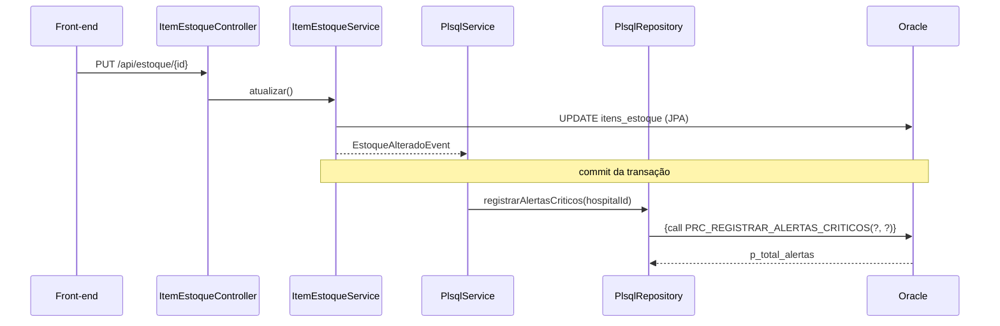

# Parte 3 - Procedures e Functions PL/SQL (Oracle)

A Parte 3 acrescenta ao schema `MEDISTOCK` da Parte 2 uma camada de inteligência em PL/SQL: duas functions, duas procedures, a tabela `ALERTAS` e a view `VW_ALERTAS_VIGENTES`. O back-end Spring Boot aciona esses objetos via JDBC quando roda com o perfil `oracle`.

| Script | Conteúdo |
|---|---|
| [`06_parte3_plsql.sql`](../../database/oracle/06_parte3_plsql.sql) | Tabela, view, functions e procedures, documentados no próprio script (propósito, parâmetros, retorno e exceções). |
| [`07_parte3_exemplos.sql`](../../database/oracle/07_parte3_exemplos.sql) | Uso das functions em consultas SQL e das procedures em blocos anônimos. |

A procedure `PR_REGISTRAR_CONSUMO` (script `03`), chamada pelo registro de consumo da API, faz parte da Parte 2 e está documentada no [README](../../README.md#plsql).

## Objetos criados

| Objeto | Tipo | O que faz |
|---|---|---|
| `fn_dias_cobertura_estoque(p_item_id)` | Function (indicador) | Estima em quantos dias o estoque do item se esgota, usando o consumo médio mensal dos últimos 6 meses. Retorna `NULL` se não houver histórico. |
| `fn_status_estoque_formatado(p_item_id)` | Function (dados formatados) | Retorna uma linha pronta para exibição: `[CRITICO] Soro fisiologico 500 ml (Hospital Demonstracao A) - 16 UN (min. 20) - vence em 20 dia(s)`. |
| `prc_registrar_alertas_criticos(p_hospital_id, p_total_alertas)` | Procedure | Percorre os itens com um `CURSOR` e grava na tabela `ALERTAS` os casos de estoque crítico/atenção, item vencido e validade próxima. Usa o subprograma local `registrar_se_novo` para não gravar o mesmo alerta (tipo e texto) duas vezes no dia, e devolve a quantidade criada. |
| `prc_relatorio_consumo_hospital(p_hospital_id, p_mes_referencia, ...)` | Procedure | Relatório de consumo de um hospital no mês: totais em parâmetros `OUT` e o detalhamento por item em um `SYS_REFCURSOR`. |
| `ALERTAS` | Tabela | Histórico persistido dos alertas gerados pela procedure. |
| `VW_ALERTAS_VIGENTES` | View | Alertas de hoje que ainda valem para a situação atual do estoque (o mais recente de cada item por categoria). É a fonte da tela **Alertas** do app no profile `oracle`. |

### Conceitos de PL/SQL utilizados

- **Parâmetros `IN`, `OUT` e `RETURN`**, com tipos ancorados em colunas (`%TYPE`)
- **`CURSOR`** explícito com `FOR ... LOOP` e **`SYS_REFCURSOR`** de saída
- **`IF / ELSIF / ELSE`** e `CASE` para as regras de negócio
- **`EXCEPTION`**: `NO_DATA_FOUND`, exceção declarada pelo usuário (`e_hospital_inexistente`), `OTHERS` com `RAISE_APPLICATION_ERROR`, e um bloco aninhado por item para que a falha de um item não interrompa os demais
- Subprograma local (`registrar_se_novo`) dentro da procedure
- Controle de transação pelo chamador: as procedures não fazem `COMMIT`/`ROLLBACK`, mesmo padrão de `PR_REGISTRAR_CONSUMO`. No Java, quem confirma é o `@Transactional`; nos exemplos, o bloco anônimo.

### Códigos de erro

A Parte 3 usa a faixa -20101 a -20121, separada dos códigos -20001 a -20005 de `PR_REGISTRAR_CONSUMO` e dos -20090 a -20098 dos scripts de implantação.

| Código | Origem | Situação |
|---|---|---|
| ORA-20101 | `fn_dias_cobertura_estoque` | Item inexistente |
| ORA-20109 / ORA-20108 | Functions | Falha inesperada |
| ORA-20110 | `prc_registrar_alertas_criticos` | Falha geral |
| ORA-20120 | `prc_relatorio_consumo_hospital` | Hospital inexistente |
| ORA-20121 | `prc_relatorio_consumo_hospital` | Falha inesperada |

## Como executar os scripts

Pré-requisito: schema `MEDISTOCK` implantado com os scripts `00` a `03` ([passo a passo no README](../../README.md#execucao)).

1. Na conexão `MEDISTOCK` / `FREEPDB1` do SQL Developer, execute [`06_parte3_plsql.sql`](../../database/oracle/06_parte3_plsql.sql) com **F5**. Ao final, a consulta mostra os seis objetos com status `VALID`.
2. Execute [`07_parte3_exemplos.sql`](../../database/oracle/07_parte3_exemplos.sql) com **F5**. As seções 7.1 a 7.8 mostram as functions em `SELECT`/`WHERE`/`ORDER BY`, o registro de alertas, os alertas vigentes, a reexecução sem duplicidade, o relatório percorrendo o cursor e o tratamento de erro.

O script `06` pode ser reexecutado: cria `ALERTAS` só se ela ainda não existir e recria os demais objetos com `CREATE OR REPLACE`. Ele não altera nem apaga as tabelas e os dados da Parte 2.

## Integração com o back-end (Java → JDBC → Oracle)

- **Evento de back-end:** ao criar (`POST /api/estoque`) ou atualizar (`PUT /api/estoque/{id}`) um item, o `ItemEstoqueService` publica um `EstoqueAlteradoEvent`. Após o commit, o `PlsqlService` (`@TransactionalEventListener`) chama `prc_registrar_alertas_criticos` para o hospital do item.
- **Rotina automatizada:** a procedure também roda ao iniciar a API e todo dia às 00:05 (`@Scheduled`, configurável em `medistock.plsql.alertas.cron`). Assim os alertas de validade acompanham a passagem dos dias mesmo sem alterações no estoque.
- **Tela Alertas:** no profile `oracle`, `GET /api/alertas` e `GET /api/alertas/resumo` leem os alertas de estoque da view `VW_ALERTAS_VIGENTES`, ou seja, exibem o que a procedure gravou. Os alertas de logística (transferências) continuam sendo montados pelo Java.
- **`PlsqlRepository`** usa `SimpleJdbcCall` para as procedures (inclusive o `REF CURSOR` de saída) e `JdbcTemplate` para as consultas que usam as functions.
- Os erros `ORA-20101`/`ORA-20120` viram HTTP 404 na API.

### Endpoints (profile `oracle`, requerem JWT)

| Método | Rota | Objeto PL/SQL |
|---|---|---|
| `POST` | `/api/plsql/alertas/processar?hospitalId=` | `prc_registrar_alertas_criticos` |
| `GET` | `/api/plsql/alertas?hospitalId=` | Leitura da tabela `ALERTAS` |
| `GET` | `/api/plsql/estoque/indicadores?hospitalId=` | `SELECT` com as duas functions |
| `GET` | `/api/plsql/relatorios/consumo/{hospitalId}?mes=AAAA-MM` | `prc_relatorio_consumo_hospital` |

Também ficam disponíveis no Swagger (`/docs`), na tag **PL/SQL (Oracle)**.

### Rodando e testando

O passo a passo para subir o back-end no Oracle e o roteiro de teste da integração estão no [README](../../README.md#testes-parte3).
