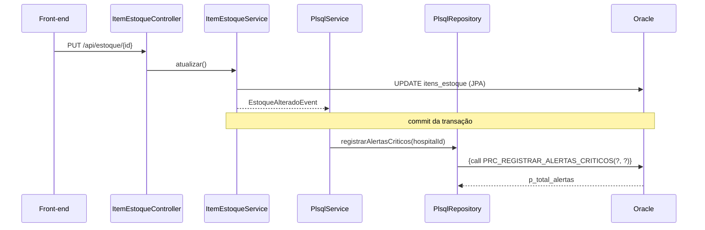

# Parte 3 - Procedures e Functions PL/SQL (Oracle)

O script [`medistock_plsql.sql`](medistock_plsql.sql) cria no Oracle o schema do MediStock (Smart HAS), os dados simulados, as functions, as procedures e exemplos de uso. O back-end Spring Boot aciona esses objetos via JDBC quando roda com o profile `oracle`.

## Objetos criados

| Objeto | Tipo | O que faz |
|---|---|---|
| `fn_dias_cobertura_estoque(p_item_id)` | Function (indicador) | Estima em quantos dias o estoque do item se esgota, usando o consumo médio mensal dos últimos 6 meses. Retorna `NULL` se não houver histórico. |
| `fn_status_estoque_formatado(p_item_id)` | Function (dados formatados) | Retorna uma linha pronta para exibição: `[CRITICO] Dipirona 500mg (Hospital das Clinicas) - 15 cx (min. 50) - vence em 45 dia(s)`. |
| `prc_registrar_alertas_criticos(p_hospital_id, p_total_alertas)` | Procedure | Percorre os itens com um `CURSOR` e grava na tabela `ALERTAS` os casos de estoque crítico/atenção, item vencido e validade próxima. Não duplica alertas no mesmo dia e devolve a quantidade criada. |
| `prc_relatorio_consumo_hospital(p_hospital_id, p_mes_referencia, ...)` | Procedure | Relatório de consumo de um hospital no mês: totais em parâmetros `OUT` e o detalhamento por item em um `SYS_REFCURSOR`. |
| `ALERTAS` | Tabela | Histórico persistido dos alertas gerados pela procedure. |

Todos os objetos estão documentados no próprio script (propósito, parâmetros, retorno e exceções).

### Conceitos de PL/SQL utilizados

- **Parâmetros `IN`, `OUT` e `RETURN`**, com tipos ancorados em colunas (`%TYPE`)
- **`CURSOR`** explícito com `FOR ... LOOP` e **`SYS_REFCURSOR`** de saída
- **`IF / ELSIF / ELSE`** e `CASE` para as regras de negócio
- **`EXCEPTION`**: `NO_DATA_FOUND`, exceção declarada pelo usuário (`e_hospital_inexistente`), `OTHERS` com `RAISE_APPLICATION_ERROR`, e um bloco aninhado por item para que a falha de um item não interrompa os demais
- Controle de transação com `COMMIT` / `ROLLBACK`

### Códigos de erro

| Código | Origem | Situação |
|---|---|---|
| ORA-20001 | `fn_dias_cobertura_estoque` | Item inexistente |
| ORA-20099 / ORA-20098 | Functions | Falha inesperada |
| ORA-20010 | `prc_registrar_alertas_criticos` | Falha geral (com rollback) |
| ORA-20020 | `prc_relatorio_consumo_hospital` | Hospital inexistente |
| ORA-20021 | `prc_relatorio_consumo_hospital` | Falha inesperada |

## Como executar o script

1. Conecte no Oracle (SQL Developer ou SQL*Plus) com o usuário do grupo.
2. Execute `medistock_plsql.sql` inteiro como script (F5 no SQL Developer).
3. As seções 6.1 a 6.7 mostram as functions em `SELECT`/`WHERE`/`ORDER BY` e as procedures em blocos anônimos (ative a saída com `SET SERVEROUTPUT ON`).

O script pode ser reexecutado: a seção 1 remove os objetos antes de recriar.

## Integração com o back-end (Java → JDBC → Oracle)



- **Evento de back-end:** ao criar (`POST /api/estoque`) ou atualizar (`PUT /api/estoque/{id}`) um item, o `ItemEstoqueService` publica um `EstoqueAlteradoEvent`. Após o commit, o `PlsqlService` (`@TransactionalEventListener`) chama `prc_registrar_alertas_criticos` para o hospital do item.
- **`PlsqlRepository`** usa `SimpleJdbcCall` para as procedures (inclusive o `REF CURSOR` de saída) e `JdbcTemplate` para as consultas que usam as functions.
- Os erros `ORA-20001`/`ORA-20020` viram HTTP 404 na API.

### Endpoints (profile `oracle`, requerem JWT)

| Método | Rota | Objeto PL/SQL |
|---|---|---|
| `POST` | `/api/plsql/alertas/processar?hospitalId=` | `prc_registrar_alertas_criticos` |
| `GET` | `/api/plsql/alertas?hospitalId=` | Leitura da tabela `ALERTAS` |
| `GET` | `/api/plsql/estoque/indicadores?hospitalId=` | `SELECT` com as duas functions |
| `GET` | `/api/plsql/relatorios/consumo/{hospitalId}?mes=AAAA-MM` | `prc_relatorio_consumo_hospital` |

Também ficam disponíveis no Swagger (`/docs`), na tag **PL/SQL (Oracle)**.

### Rodando o back-end no Oracle

Sem profile, a aplicação continua usando SQLite. Para usar o Oracle, depois de executar o script:

```bash
SPRING_PROFILES_ACTIVE=oracle \
ORACLE_URL=jdbc:oracle:thin:@oracle.fiap.com.br:1521:ORCL \
ORACLE_USER=rmXXXXX \
ORACLE_PASSWORD=******** \
./mvnw spring-boot:run
```

As variáveis também podem ficar no arquivo `.env` na raiz do projeto.
